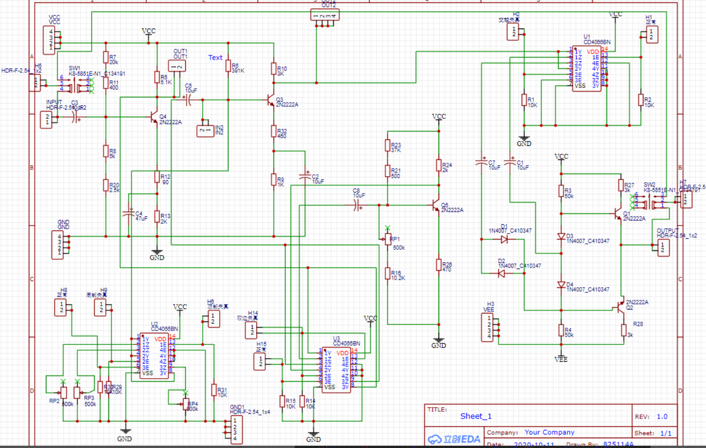

# 放大器非线性研究装置

## 题目基本要求

&ensp;&ensp;题目要求设计并制作一个放大器非线性失真研究装置，能输出无明显失真、底部失真、顶部失真、双向失真、交越失真五种波形，以及测量并显示他们的总谐波失真（THD）。

    总谐波失真（THD）：这也是在放大器中提的最多的一种失真。其定义方式为输入单一频率的余弦信号，输出的各次谐波总有效值和基波功率有效值之比的平方根

## 设计方案
&ensp;&ensp;本设计是一个能产生非线性失真的晶体管放大器，由两级共射放大电路以及一级推挽电路构成。可以通过调节放大器内各个电阻的阻值，来变更静态工作点，使电路输出无明显失真、底部失真、顶部失真、双向失真、交越失真五种波形。

&ensp;&ensp;本设计使用单片机去控制电子开关4066的通断来改变共射放大电路中的电阻来切换失真波形。再将波形经过调理电路（将信号控制在0～3.3v）交给单片机的A/D去采集，利用快速FFT来输出频谱分析计算，得到输出波形的总谐波失真以及各级谐波分量，最后将计算结果和显示波形一并放在单片机控制的OLED屏上进行显示。

系统框图如下

*系统框图*

PCB原理图如下

*PCB原理图*

系统仿真图

Multisim仿真已经上传，就不截图了

## 软件部分

### 单片机AD采集分析数据
#### ADC+DMA
&ensp;&ensp;要进行FFT分析，就需要对待测波形进行实时采样以得到连续数值。

&ensp;&ensp;根据奈奎斯特（Nyquist）定律， 如果被测信号带宽是有限的，那么在对信号进行采样和量化时，如果采样率是被测信号带宽的2倍以下，就会导致信号混叠，所以要设置好合适的采样频率。

&ensp;&ensp;DMA搬运传输可可以大大的减少CPU的工作量且尽可能完整的采集波形。

#### 快速傅里叶变换（FFT）
&ensp;&ensp;我们利用快速傅里叶变换去快速的得到信号的频谱直接提取。那么按照奈奎斯特采样定理。我们最小只需要最高信号频率两倍的采样也就是2K就可以还原原信号。

&ensp;&ensp;但是，FFT只有256，512，1024这样的非整数点。那么用2K去采样1K的信号。

&ensp;&ensp;假设采集256个点。那么每个点的频率分辨率是2000/256也就是7.8125每个点。我们的1K信号，正好落在FFT之后出来的第128个点上。看起来好完美的说。但是我们的直流分量又在第一个点。我们需要的两个重要信号都在最边缘。假设信号偏了半点。变成了1.05k。那么我们的频谱里，就没有它的影子了。假设使用6.4KHZ的采样去采集。那么我们每个点对应的是25HZ，1KHZ落在第40个点。正好在中间附近不远处。即频率偏离一点，我们也能在40点位置得到幅度很强的值。

&ensp;&ensp;为了让数据足够准确，那么就要让1K信号刚好落在某个确切的点上，此时就需要计算采样频率到底该取多少合适。所以我们使用EXCEL拉表格直接计算出整数的分频系数。找到1K信号落在哪个点上。为了使计算更加快速，程序里采用的是整数型FFT。

# 显示部分

&ensp;&ensp;显示部分使用的是OLED液晶显示器，四线的I2C总线。

&ensp;&ensp;是移植Hal库的软件IIC，可以随意设置引脚。
显示定时器实时采样波形，汉字取模的失真类型以及计算的THD值。

# 控制部分（按键）

&ensp;&ensp;采用独立按键。通过按键检测是否摁下，切换GPIO输出01控制4066切换不同的失真波形。

（为了稳定控制切换成功，GPIO需要接三极管放大电流）

## 附加项 自由发挥部分

&ensp;&ensp;我们将信号发生器替换成DDS产生正弦信号

&ensp;&ensp;方案1：直接采用信号发生器芯片AD9850，采用SPI通讯方式，送频率字和幅度字。

&ensp;&ensp;方案2：DDS。基本结构包括相位累加器、正弦查询表（ROM）、数模转换器（DAC）和低通滤波器（LPF）组成。

&ensp;&ensp;因为之前实训用FPGA做过DDS正弦信号发生器，有高速DAC902,故修改一下可以直接拿来用。我csdn之前上传过代码部分，这里是[下载链接](https://download.csdn.net/download/sanjiudemiao/12601830)。
